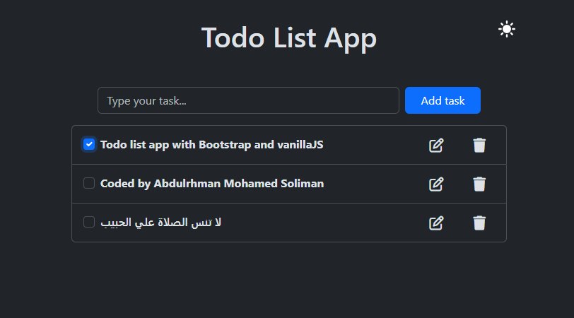

# Todo List App

This is a simple and elegant Todo List application built with HTML, CSS, and JavaScript. The app uses Bootstrap for styling and FontAwesome for icons. It allows users to add, edit, delete, and mark tasks as complete. The app also supports dark mode and saves tasks in the browser's local storage.

## Features

- **Add Tasks**: Users can add new tasks to the list.
- **Edit Tasks**: Users can edit existing tasks.
- **Delete Tasks**: Users can delete tasks from the list.
- **Mark as Complete**: Users can mark tasks as complete.
- **Dark Mode**: Users can switch between light and dark modes.
- **Local Storage**: Tasks are saved in the browser's local storage, so they persist even after the page is refreshed.

## Preview



## Installation

1. Clone the repository:

   ```sh
   git clone https://github.com/your-username/todo-list-app.git
   ```

2. Navigate to the project directory:

   ```sh
   cd todo-list-app
   ```

3. Install the dependencies:

   ```sh
   npm install
   ```

## Usage

1. Open [index.html](http://_vscodecontentref_/1) in your browser to view the app.
2. Add, edit, delete, and mark tasks as complete using the provided interface.
3. Toggle between light and dark modes using the button in the top-right corner.

## Dependencies

- [Bootstrap](https://getbootstrap.com/) - For styling and responsive design.
- [FontAwesome](https://fontawesome.com/) - For icons.

## Contributing

Contributions are welcome! Please open an issue or submit a pull request for any improvements or bug fixes.

## License

This project is licensed under the MIT License. See the LICENSE file for details.
